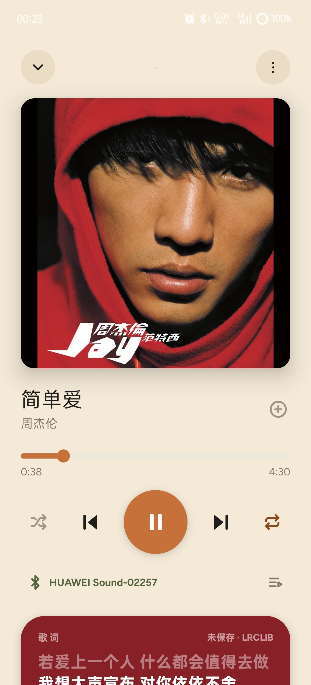

# 拾音PickUpMusic

> 本地音乐播放器从来不缺，缺的是完整的音乐体验。

不同来源下载的本地音乐，往往缺少对应封面、歌词或完整的专辑信息；普通播放器通常只能把文件播放出来，如想获得完整如同流媒体的体验，用户要付出高昂的时间成本。拾音便是为了解决这个痛点诞生的。

<p align="center">
  
</p>
<p align="center">
  
</p>
## 核心能力

### 1. 音乐资源匹配 —— 自动补全缺失的歌词、封面与信息

- **歌词自动匹配**：LRCLIB 与网易云两源级联，能够识别大部分音乐，并允许用户上传lrc文件进行补充。
- **封面自动匹配**：从 iTunes 拉取候选封面，自动识别最符合的一张，若不匹配亦可手动修改。
- **歌曲信息**：基于文件名与已有元数据，允许用户更改修正专辑、歌曲、歌手信息，解决本地音乐信息错误的问题。
- **歌手写真自动获取**：从 Discogs、AudioDB 等多源并行匹配歌手人物写真，可手动挑选 / 粘贴链接 / 选本地文件替换，小众歌手回退专辑封面。


### 2. 本地音乐库信息管理 —— 辟除杂音

- **排除目录与文件**：录音、通话录音、通知音、其他 App 的音频，先挡在音乐库之外，而不是扫进来再一个个手动删。
- **歌手归一化**：可手动合并同一歌手的多个名字（如 `fujiikaze` / `藤井风`），并支持事后撤销。

### 3. 以专辑为中心

- **无缝播放（gapless）**：丝滑播放体验，不把专辑曲目之间的衔接打断。
- **专辑歌曲排序**：解决专辑内歌曲乱序的问题，支持手动拖拽排序；文本排序模式可一键复制当前顺序交给 AI 联网排序后粘回。
- **专辑与歌曲分开维护**：一张专辑的元数据单独编辑，不与单首歌耦合；歌曲归属专辑可以单独迁移。

### 4. 更接近音乐软件的体验

- **歌手主页**：沉浸式写真折叠头，上下滑歌手名平滑滑入顶栏，Spotify 式一镜到底；写真多源自动获取，可手动替换。
- **搜索**：专辑名命中整张置顶、跨字段分词匹配，结果首位为歌手行（圆头像）。
- **歌单**：自建歌单，专辑式大封面（多专辑自动拼贴）+ 每曲显各自封面；内置不可删的「我的喜欢」。
- **音频输出路由**：自由切换扬声器 / 耳机 / 蓝牙切换；
- **歌词本**：仿spotify界面的全屏歌词阅读界面，配色随封面联动。
- **振假名**：日语歌词汉字上方标注假名注音（歌词本展开页「あ」开关），部分错误可长按修改。
- **收听统计**：查看每周收听情况、最近播放记录，以及通过「你的更新」了解音乐库中新识别和新增的专辑。

## 下载与构建

```bash
git clone https://github.com/richenxiao/pickupmusic.git
cd pickupmusic
./gradlew assembleDebug        # Windows 下用 gradlew.bat
```

产物路径：`app/build/outputs/apk/debug/app-debug.apk`

环境要求：JDK 17+、Android SDK 36（compileSdk / targetSdk）、最低支持 Android 12（minSdk 31）。仓库自带 Gradle Wrapper，克隆后无需全局安装 Gradle。

### 构建 Release（需自行配置签名）

仓库不含任何真实签名密钥与密码。要构建 Release，按 `keystore.properties.example` 自行准备你自己的签名：

1. 生成你自己的 keystore：
   ```bash
   keytool -genkey -v -keystore my-release.keystore -alias my-key \
     -keyalg RSA -keysize 2048 -validity 10000
   ```
2. 复制 `keystore.properties.example` 为 `keystore.properties`，填入你的 keystore 路径与密码。
   （`keystore.properties` 与 `*.jks` / `*.keystore` 均在 `.gitignore`，不会被提交。）
3. 构建：
   ```bash
   ./gradlew assembleRelease
   ```

产物路径：`app/build/outputs/apk/release/app-release.apk`


## 技术栈

| 技术 | 用途 |
|------|------|
| Kotlin | 开发语言 |
| Jetpack Compose | UI 框架 |
| Material 3 | 设计系统 |
| AndroidX Media3 (ExoPlayer) | 音频播放引擎，后台播放 + MediaSession |
| Room / DataStore | 本地数据库 / 键值偏好 |
| Coroutines / Flow | 异步与响应式 |
| OkHttp / Gson | 网络请求 / JSON 解析 |
| AndroidX Palette | 专辑封面主色提取，驱动动态取色 |

完整版本号、依赖与构建细节见 `app/build.gradle.kts`。

## 项目结构

```
PickUpMusic/
├── app/
│   ├── src/main/
│   │   ├── java/com/shiyin/music/
│   │   │   ├── data/
│   │   │   │   ├── ai/              # AI 服务（DeepSeek 元数据识别）
│   │   │   │   ├── colors/          # 封面主色提取（PaletteExtractor）
│   │   │   │   ├── normalize/       # 歌手名归一化
│   │   │   │   ├── image/            # 歌手写真解析层（多源 resolver + 缓存 + 覆盖）
│   │   │   │   ├── recognition/     # 歌手头像抓取
│   │   │   │   ├── db/             # Room 数据库（实体、DAO、迁移）
│   │   │   │   ├── lyrics/         # 歌词解析与匹配（LRC / USLT / LRCLIB / 网易云）
│   │   │   │   ├── MediaScanner.kt  # 媒体库扫描
│   │   │   │   └── SettingsStore.kt  # DataStore 设置与最近播放
│   │   │   ├── playback/            # 后台播放服务、播放控制器、音频设备路由
│   │   │   ├── ui/
│   │   │   │   ├── components/      # 通用 UI 组件
│   │   │   │   ├── screens/         # 页面（首页 / 搜索 / 音乐库 / 播放器 / 歌词 / 设置 等）
│   │   │   │   └── theme/           # 主题与配色
│   │   │   ├── MainActivity.kt
│   │   │   ├── MainViewModel.kt
│   │   │   └── AppRoot.kt           # 导航根组件
│   │   ├── res/                     # 资源文件（含各档位应用图标）
│   │   └── AndroidManifest.xml
│   └── build.gradle.kts
├── gradlew / gradlew.bat            # Gradle Wrapper（仓库自带）
├── keystore.properties.example      # Release 签名占位模板
├── local.properties.example         # 本机 Android SDK 路径占位模板
├── LICENSE                          # MIT 许可证
└── README.md
```

## 隐私说明

- 本地音乐扫描与播放均在设备本地完成。
- 网络访问仅用于：抓取歌手写真（Discogs / AudioDB / Fanart 等多源）、匹配歌词与封面（LRCLIB / 网易云 / iTunes）、调用你自配的 DeepSeek API 做元数据识别。
- 不会上传你的本地音乐文件或收听记录到任何服务器。

## 许可证

本项目基于 MIT 许可证开源。详见 [LICENSE](LICENSE)。
